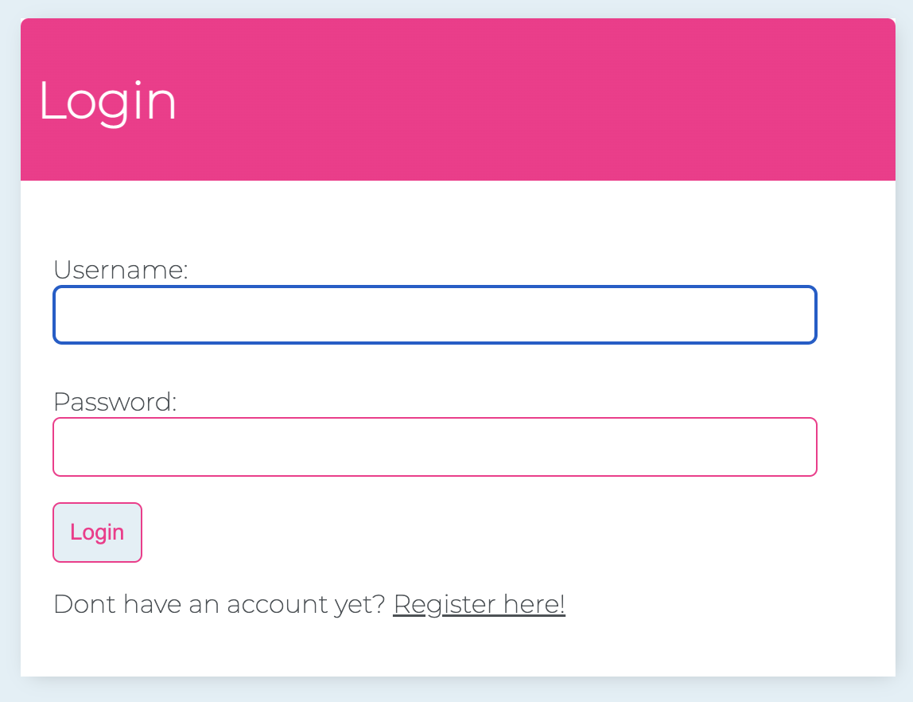
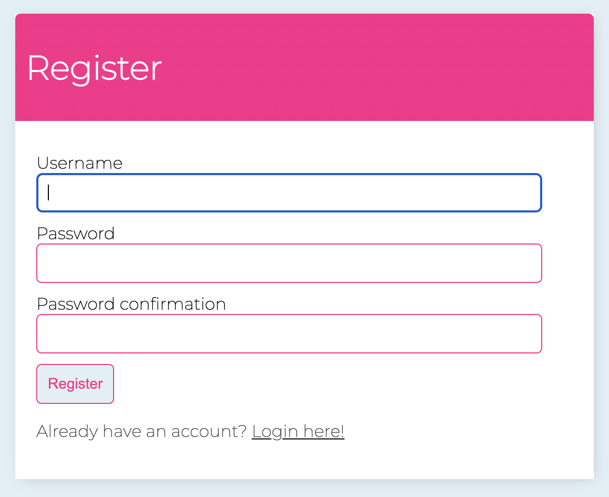
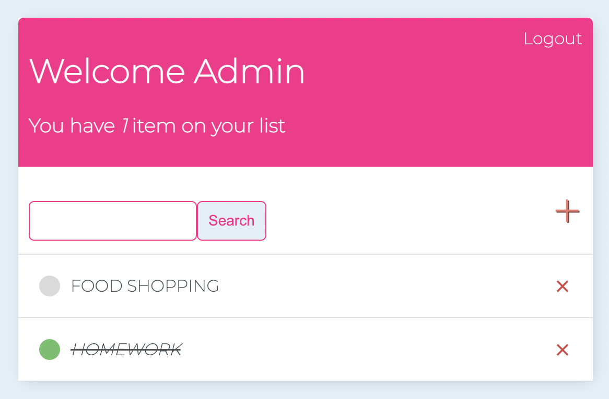
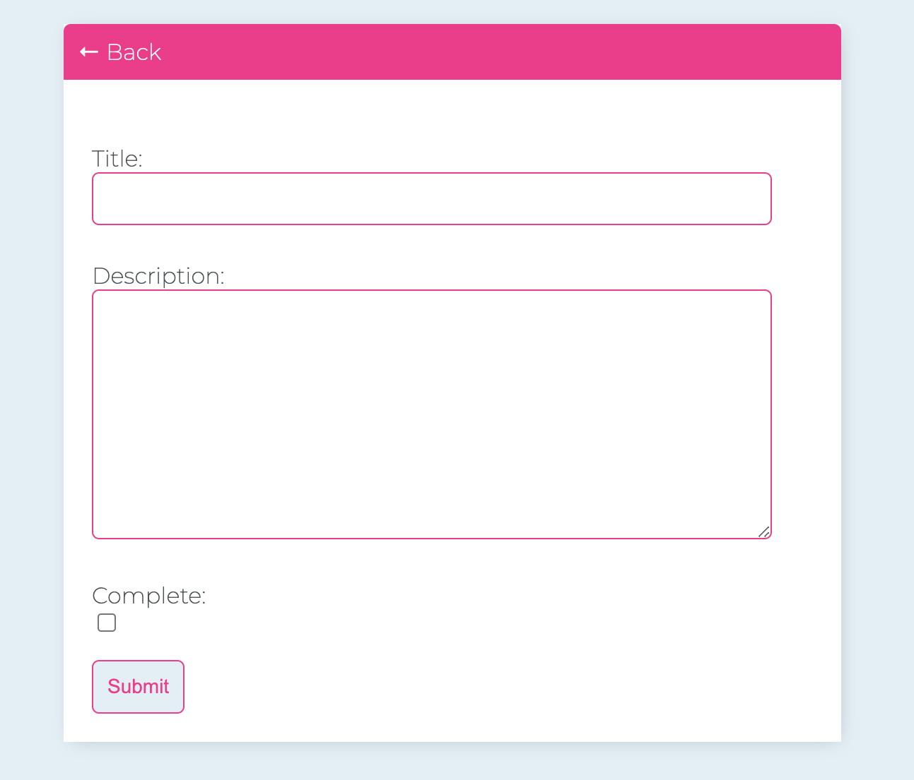
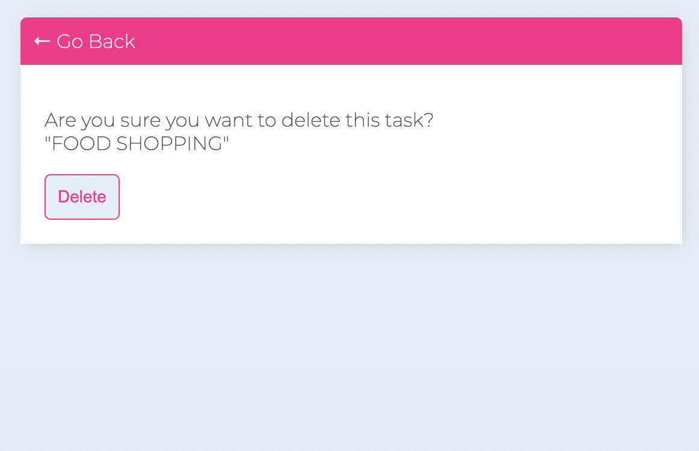

<h1>ToDo App</h1>

The project has been undertaken to create a web based application that gives the user a ToDo list that is interactive and aesthetically pleasing woth basic requrired functionality.

Visit ToDo app here [here](https://todo-2326-app.herokuapp.com/login/?next=/).

The aims of this site is to give the user a qick and easy ability to add complete and change details of events that assist in organising their day to day tasks.

# Table of Contents:
- [**UX**](#ux)
  * [User aims](#user-aims)
  * [Strategy](#strategy)
  * [Structure](#structure)
- [**Features**](#features)
  * [1. Login](#1-login)
  * [2. Home](#2-home)
  * [3. Edit](#3-edit)
- [**Technologies used**](#technologies-used)
  * [Websites](#websites)
- [**Testing**](#testing)
  * [Code Validators](#code-validators)
  * [Manual Testing](#manual-testing)
  * [Bugs and Fixes](#bugs-and-fixes)
  * [Improvements](#improvements)
- [**Deployment**](#deployment)
  * [heroku deployment:](#heroku-deployment)
    * [Credit](#credit)
- [**Resubmition Notes**](#resubmition-notes)

# **UX**
## 1. User aims
Here I have a list I created of things  that I would look for/ expcet in a website as a user.

As a user, I would like to quickly and effectively understand the purpose and information of the site.
As a user, I need to be able to easily navigate the website.
As a user, I would like to use the site on mobile and desktop.
As a user, I would like to ba able to sign up and login in quick and easy.

Returning Users

As a returning user, I would like to be able to get straight into the seeing my tasks and updating them.

## 2. Strategy
Project goals

The aim of this project is to build a ToDo with a key focus on django to create a seamless Todo list platform with a way of storing data.

## 3. Structure

The structure of the ToDo app is foccused on UX interface with a plain simple but effective layout, by doing this this can make it easily accesible by a user any where.

# **Features**

## 1. Login
This is the most important part of my code. This has to be clear and functioning perfect for the rest of the code to be useful. This is where the user discovers the ToDo app and its a first impression. They are met with the option to log back in or sign up as a new user. to gain the most amount of users it is important that at this point the app is represented well so it looks like an app worth signing up for.

__register__

## 2. Home
This is the central point of the webapp. Here the user can, see their list, items in list, username logout option and ability to selet each task item. 

## 3. Edit
This is where the user can add the title to the task , add a description to it and make it complete or not.
this is where the user input is taken.
there is another page for deleting tasks whick ask the user for confirmation first.

__delete__

# **Technologies used**
## Websites

In the creation of this website there were multiple websites I used. Below is a list to credit them and their use in my site.
__heroku__
Used for the deployment of my website
(https://dashboard.heroku.com/)

__coolers__
(https://coolors.co/)
This is where i got my color pallete that i used to style my project. It offers an aesthetic look but also minimalistic.

# **Testing**

## Code validators 
I used 2 code validators for my site one for the html and one for the css.

__html__
(https://validator.w3.org/)

__css__
(https://jigsaw.w3.org/css-validator/)

 __python__
 (http://pep8online.com/checkresult)

## Manual testing

The maual testing i done was mainly carried ut by using the command {python3 manage.py runserver}.
this gave me a preview of the code in a locally deployed website on PORT 8000. Here I could see UX and functionality.

By doing this it would also allow me to interact with my code and see what the user is going to experience.

I could check links and all the pages to see if they were coded corectly and spot any code bugs early.

I also sent to friends and family in order to get them to use the site and report and bugs or imporvements.

## Bugs and Fixes

During this project I ran in to many bugs as expected. I used many sources to help me find fixes or solutions (noted below) 
I found it very easy to make small syntax errors with django which made this project very time costly.
I need more assistance with this project than previous ones. but by the end i got a better grasp for django. 

Getting the pages to link up as they are required was difficult but by the end i got to understand it better, with the use of (
) whcih is something new with django for me. This helped solve alot of issues.

## Improvements

There are three things I identified during my project and on review that I was unable to do, for lack of knowledge that I would have liked to incorporate. I hope to learn how to do this to be able to incorporate in future projects.

I would like to add more feautures, such as adding more options and add more user information.

I would like to add more specifics to the events such as due date and importance order and expired notification.

I would like to add more interactivity and give the user more space to give more specific information. 

# **Deployment**
## heroku deployment 

This project was deployed using Heroku.

__steps for deployment__
    - Create a new Heroku app.
    - Under the settings tab for the new app, go to the Config Vars section.
    - Add `PORT` in the KEY section and add `8000` into the VALUE section
    - Still in the settings tab, go to the Buildbacks section.
  
            - Open the Terminal in your Gitpod workspace.
            - Enter the command `heroku login -i` to login to your Heroku account.
            - Enter the command `heroku apps` to get the app name for this repo.
            - Enter the command `heroku git:remote -a app_name` with `app_name` replaced with the app name you created.
            - Add and commit any changes to your code if applicable.
            - Push code to both GitHub & Heroku by using the below commands:
                - GitHub: `git push origin main`
                - Heroku: `git push heroku main`

## Credit

Stackoverflow (https://stackoverflow.com/)
Slack
Tutor help
youtube(https://www.youtube.com/c/programmingwithmosh)

# **Resubmition Notes**

On recevial of my first review i identified 2 main areas that caused need for resubmittion.
The first being Debug set to true.
This was a very easy fix and I have resolved it on the settings.py page adn set it to false and then tested the site again.
Nest was the lack of agile documentation and path. so i have taken the time to retrace my steps and thought process from my note pad and place them on the githup issuse and milestone pages along with creating a AGILE.md document to show where i had used it and make it clear.
I have also included there a description of my color themes for the site too.
Through doing this my apprecation for agile has grown and i look to do agile in a different way moving forward.
i have left the link to this document where you can find my updated agile and stories.
[Here](AGILE.md)
